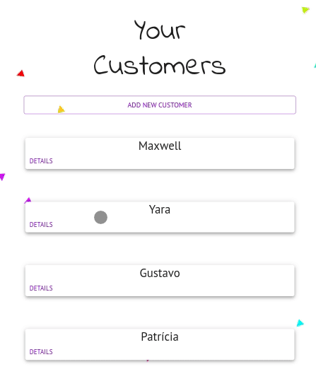

# YourClients

<p align="center">
    <a href="https://wakatime.com/badge/user/97595b44-027b-4695-a588-53e9c884f7e2/project/c160d075-a9bb-4179-9b5b-cf607f0c2962"></a>
    
    <a href="https://github.com/yaratavares/YourCustomers/commits/master">
    
  </a>
   </p>
</p>
<p align="center">
 <a href="#projeto">Projeto</a> •
  <a href="#objetivo">Objetivo</a> •
 <a href="#funcionalidades">Funcionalidades</a> •
 <a href="#layout">Layout</a> • 
 <a href="#como-executar">Como executar</a> • 
 <a href="#autora">Autora</a>
</p>

## 💻 Projeto

No app YourCustomers você pode obter uma lista de todos os seus clientes, adicionar, editar, remover e listar! ✨

---

## ⚙️ Funcionalidades

- [x] CRUD para clientes:

  - [x] GET
  - [x] POST
  - [x] PUT
  - [x] DELETE

- [x] Utilizando Typescript

- [x] Utilizando material-ui

---
## 🎨 Layout




## 🚀 Como executar o projeto

Este projeto está dividido em duas partes:

1. [Backend](https://github.com/yaratavares/API-yourCustomers) 🎲
2. Frontend (este repositório) 

💡 O front-end não precisa que o back-end esteja rodando para funcionamento da aplicação.

Para ver as funcionalidades basta acessar o último deploy ou clicar no link da [página](https://your-customers.vercel.app/).

### Pré-requisitos

Para rodar a aplicação na sua máquina, você vai precisar ter instalado em sua máquina as seguintes ferramentas:
[Git](https://git-scm.com), [Node.js](https://nodejs.org/en/) e [MongoDB](https://www.mongodb.com/docs/manual/tutorial/getting-started/).
Além disto é bom ter um editor para trabalhar com o código como [VSCode](https://code.visualstudio.com/).

####  Rodando a aplicação web (Front-end) 🧭


```bash
# Clone este repositório
$ git clone git@github.com:yaratavares/YourCustomers.git
# Acesse a pasta do projeto no terminal/cmd e instale as dependências
$ npm install
# Será necessário criar uma pasta .env como segue o modelo do arquivo .env.example
# Execute a aplicação em modo de desenvolvimento
$ npm run start
# O servidor iniciará na porta:3000 - acesse http://localhost:3000
```

---

## 🛠 Tecnologias

As seguintes ferramentas foram usadas na construção do projeto:


### Front-end

<p >
<a src="https://reactjs.org/">
 </a><a src="https://github.com/ReactTraining/react-router/tree/master/packages/react-router-dom"></a>
<a src="https://axios-http.com/"></a>
<a src='https://mui.com/pt/'>

</a> <a src="https://react-hot-toast.com/"></a> 
</p>

> Veja o arquivo [package.json](./package.json)

### Back-end

<p>
<a src="https://nodejs.org/en/"></a>

<a src="https://expressjs.com/pt-br/"></a>
<a src="https://www.mongodb.com/docs/manual/tutorial/getting-started/"></a>
<a src="https://joi.dev/"></a>
<a src="https://github.com/expressjs/cors"></a>
<a src="https://github.com/motdotla/dotenv"></a>
<a src='https://jestjs.io/docs/next/getting-started'>

</a>
</p>


> Veja o arquivo [package.json](https://github.com/yaratavares/API-YourClients/blob/main/package.json)

---

## 🧜‍♀️ Autora

<a href="https://www.linkedin.com/in/yaracristinatavares/" >
 
 <p>Yara Tavares 🚀</p>
</a>
